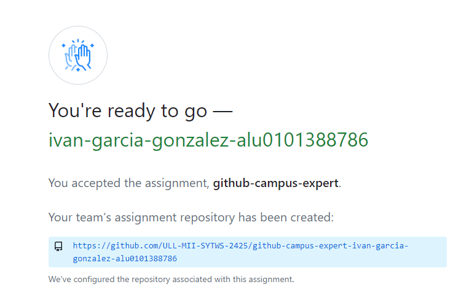
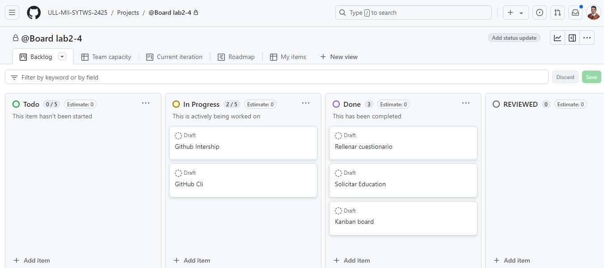
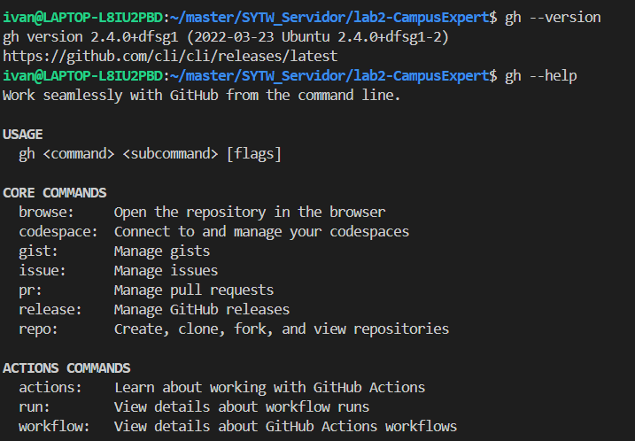

## GitHub Campus Expert
Esta es una práctica introductoria donde se han realizado las siguientes tareas

### 1. Aceptar la asignación de la práctica

Se acepta la asignación de la práctica

### 2. Creación del project board automated kanban
Se crea una board con los requisitos de la práctica

### 3. Solicitar el Student developer pack
Se solicita el Student developer pack tal y como se ve en la imagen.

En este caso, este paso ya se había realizado antes de cursar esta asignatura, por lo que no se dispone de más imágenes del proceso.

### 4. Solicitar una GitHub Intership
Me suscribo al newsletter de GitHub internships

### 5. Se ha instalado GitHub CLI
GitHub CLI descargado en maquina local:

### Finalización de la práctica
Una vez finalizada la práctica, se actualiza el README.md en el repositorio correspondiente y se suben el link y los archivos indicados a la tarea del campus virtual de la asignatura.